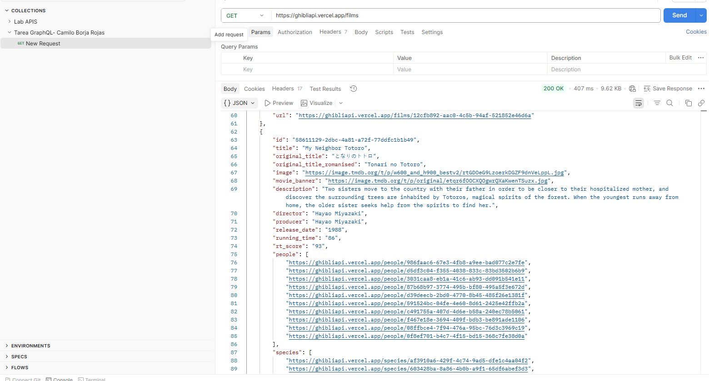
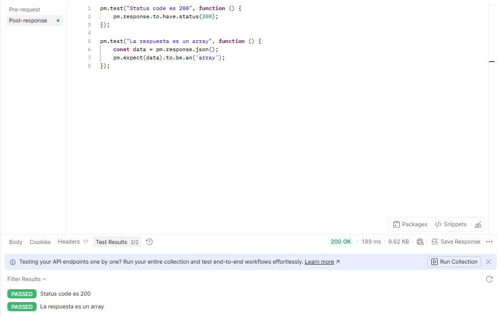
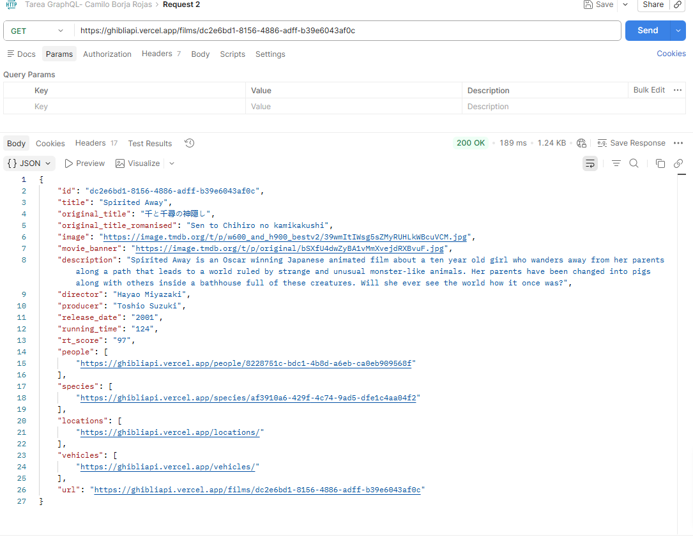
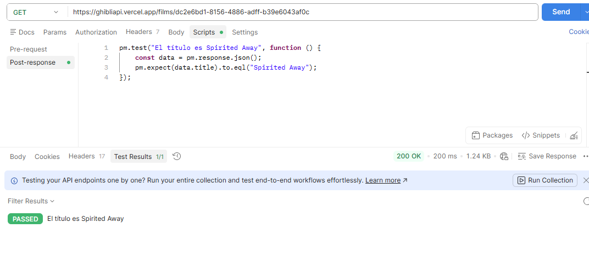
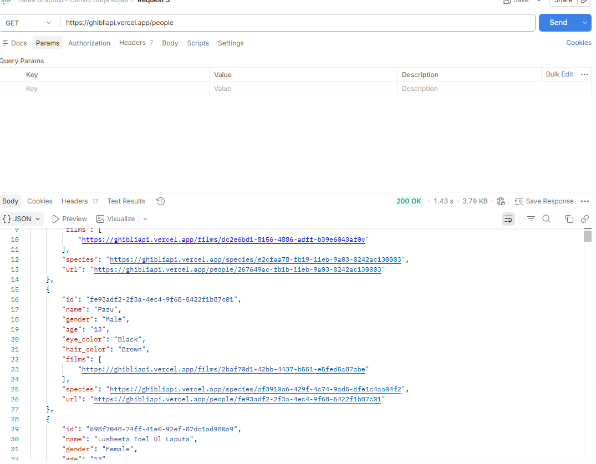
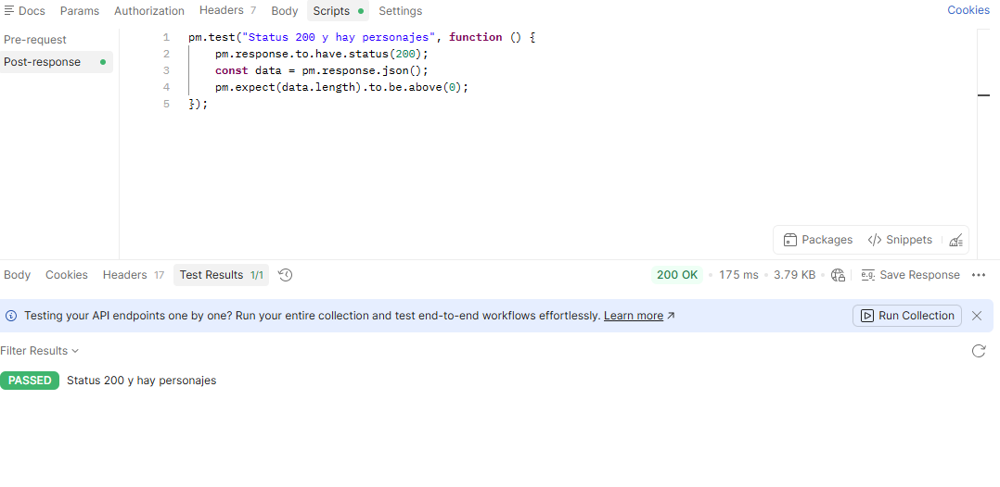
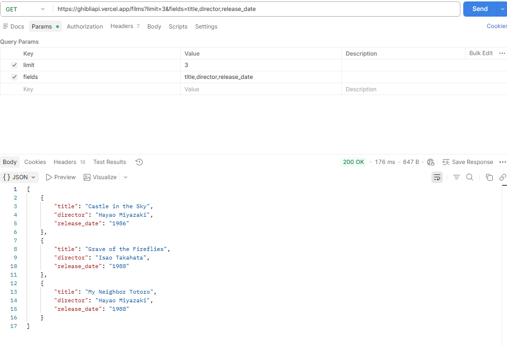
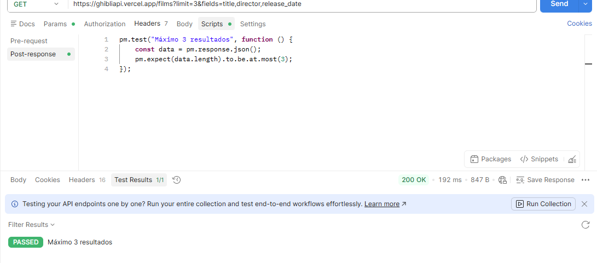
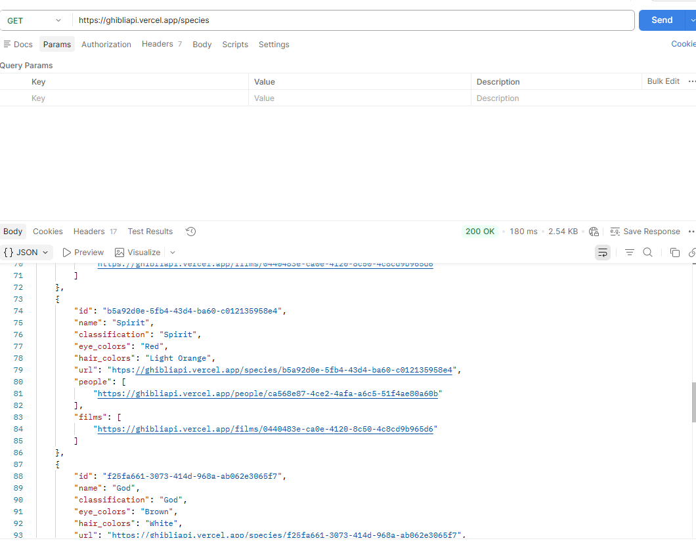
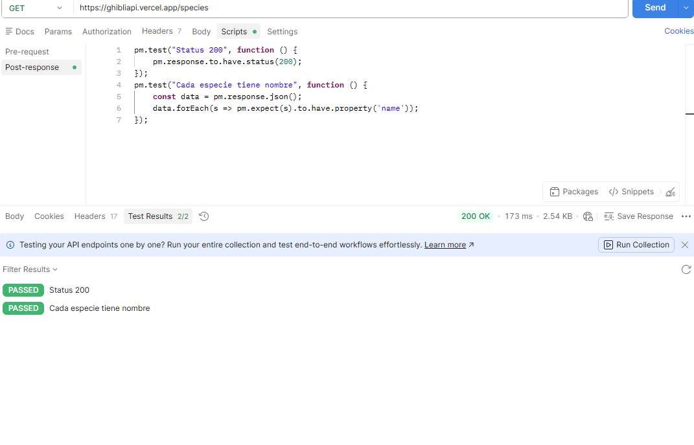

# Tarea REST API — Studio Ghibli API

**API usada:** https://ghibliapi.vercel.app  

---

## Request 1 — GET todas las películas

**URL:** `GET https://ghibliapi.vercel.app/films`

Se hace una petición GET al endpoint `/films`. La API responde con un array JSON que contiene todas las películas del estudio Ghibli. Cada objeto incluye campos como `id`, `title`, `original_title`, `director`, `producer`, `release_date`, `running_time`, `rt_score`, y URLs relacionadas a personajes, especies y vehículos.

**Código de estado recibido:** `200 OK`

---

## Request 1 — Tests automáticos

Se escribieron 2 tests automáticos en la pestaña **Scripts > Post-response**:

- **"Status code es 200"** → verifica que la respuesta llegue con código 200.
- **"La respuesta es un array"** → verifica que el cuerpo de la respuesta sea un array JSON.

Ambos tests aparecen en verde con estado **PASSED**.

---

## Request 2 — GET una película por ID

**URL:** `GET https://ghibliapi.vercel.app/films/dc2e6bd1-8156-4886-adff-b39e6043af0c`

Se consulta una película específica usando su ID único (UUID). En este caso se obtiene **Spirited Away** (El viaje de Chihiro). La respuesta trae un solo objeto con todos sus datos: director Hayao Miyazaki, año 2001, duración 124 min, score en Rotten Tomatoes de 97, y URLs relacionadas a personajes y especies.

**Código de estado recibido:** `200 OK`

---

## Request 2 — Test automático

Se escribió 1 test automático que verifica que el título de la película devuelta sea exactamente **"Spirited Away"**. El test aparece con estado **PASSED**.

---

## Request 3 — GET todos los personajes

**URL:** `GET https://ghibliapi.vercel.app/people`

Se consulta el endpoint `/people` que devuelve la lista completa de personajes del universo Ghibli. Cada objeto incluye `id`, `name`, `gender`, `age`, `eye_color`, `hair_color`, y URLs que relacionan al personaje con su película y especie. Por ejemplo, se puede ver a **Pazu** (de El castillo en el cielo) y a **Lusheeta Toel Ul Laputa**.

**Código de estado recibido:** `200 OK`

---

## Request 3 — Test automático

Se escribió 1 test automático que verifica dos cosas en uno:
- Que el código de estado sea 200.
- Que el array de personajes tenga al menos 1 elemento (`length > 0`).

El test aparece con estado **PASSED**.

---

## Request 4 — GET con query params (limit y fields)

**URL:** `GET https://ghibliapi.vercel.app/films?limit=3&fields=title,director,release_date`

Se usa la pestaña **Params** para agregar dos query params:
- `limit = 3` → trae solo las primeras 3 películas.
- `fields = title,director,release_date` → filtra los campos que devuelve la respuesta.

El resultado es un array de 3 objetos con únicamente título, director y año de estreno. Esto demuestra el uso de query params múltiples en una sola petición.

**Código de estado recibido:** `200 OK`

---

## Request 4 — Test automático

Se escribió 1 test automático que verifica que la respuesta tenga como máximo 3 elementos (`at.most(3)`), confirmando que el parámetro `limit` funcionó correctamente.

El test aparece con estado **PASSED**.

---

## Request 5 — GET todas las especies

**URL:** `GET https://ghibliapi.vercel.app/species`

Se consulta el endpoint `/species` que devuelve las especies del universo Ghibli (humanos, espíritus, dioses, etc.). Cada objeto tiene `id`, `name`, `classification`, `eye_colors`, `hair_colors`, y URLs que relacionan la especie con sus personajes y películas. Por ejemplo se pueden ver las especies **Spirit** y **God** de la película Princess Mononoke.

**Código de estado recibido:** `200 OK`

---

## Request 5 — Tests automáticos

Se escribieron 2 tests automáticos:

- **"Status 200"** → verifica que la respuesta llegue exitosamente.
- **"Cada especie tiene nombre"** → itera sobre todos los objetos del array y verifica que cada uno tenga la propiedad `name`.

Ambos tests aparecen con estado **PASSED**.

---

## Resumen

| # | Método | Endpoint | Descripción | Código |
|---|--------|----------|-------------|--------|
| 1 | GET | `/films` | Todas las películas | 200 OK |
| 2 | GET | `/films/:id` | Spirited Away por ID | 200 OK |
| 3 | GET | `/people` | Todos los personajes | 200 OK |
| 4 | GET | `/films?limit=3&fields=...` | Películas con query params | 200 OK |
| 5 | GET | `/species` | Todas las especies | 200 OK |

## ¿Qué aprendí diferente vs JSONPlaceholder?

- Los IDs son **UUIDs** (cadenas largas) en lugar de números enteros simples.
- Los recursos están **relacionados entre sí** mediante URLs, lo que simula una API más real y compleja.
- La API devuelve datos culturales reales con campos más ricos (scores, títulos en japonés, imágenes, etc.).
- No requiere ningún tipo de token ni registro, lo que facilita el aprendizaje sin configuración extra.
