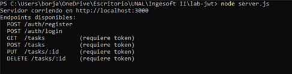
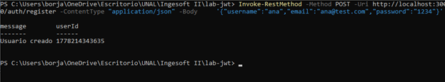
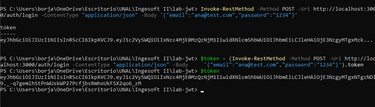
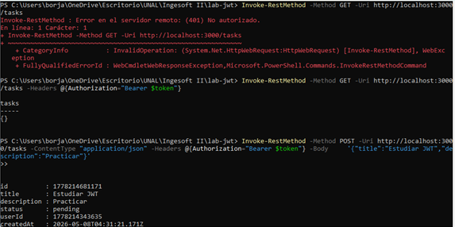
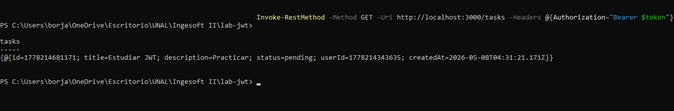
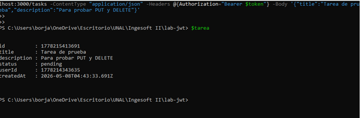
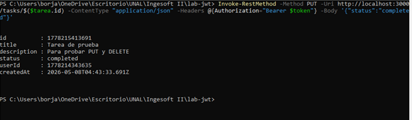
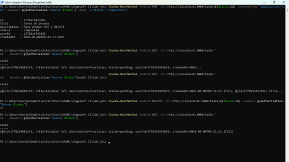
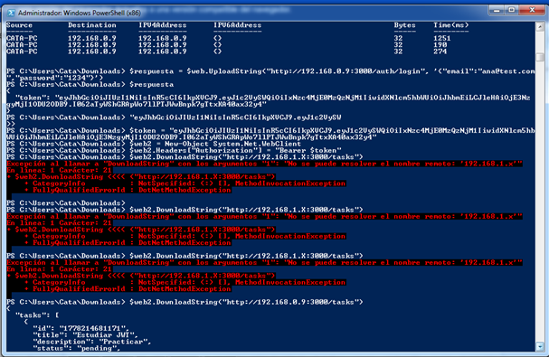

# Laboratorio JWT - API REST con Node.js

## Descripción
Laboratorio de autenticación con JWT (JSON Web Tokens) usando una API REST en Node.js. Se probaron los endpoints de autenticación y gestión de tareas, incluyendo conexión remota desde otro equipo mediante WebClient de PowerShell.

---

## Parte 1 - Configuración y endpoints básicos

### Arrancar el servidor

Se inicia el servidor con `node server.js`, el cual expone los siguientes endpoints:

```
POST   /auth/register    
POST   /auth/login       
GET    /tasks            (requiere token)
POST   /tasks            (requiere token)
PUT    /tasks/:id        (requiere token)
DELETE /tasks/:id        (requiere token)
```



---

### Register

Se registra el usuario `ana` con el email `ana@test.com`.

```powershell
Invoke-RestMethod -Method POST -Uri http://localhost:3000/auth/register `
  -ContentType "application/json" `
  -Body '{"username":"ana","email":"ana@test.com","password":"1234"}'
```

**Respuesta:**
```
message        userId
-------        ------
Usuario creado 1778214343635
```



---

### Login y almacenamiento del token

Se realiza login y se almacena el token en la variable `$token`.

```powershell
$token = (Invoke-RestMethod -Method POST -Uri http://localhost:3000/auth/login `
  -ContentType "application/json" `
  -Body '{"email":"ana@test.com","password":"1234"}').token

$token
```

**Respuesta:** Token JWT generado y almacenado correctamente.



---

### Validar token y obtener tareas

Sin token se obtiene error 401. Con token se listan las tareas correctamente.

```powershell
# Sin token - error 401
Invoke-RestMethod -Method GET -Uri http://localhost:3000/tasks

# Con token
Invoke-RestMethod -Method GET -Uri http://localhost:3000/tasks `
  -Headers @{Authorization="Bearer $token"}
```

### Crear una tarea

```powershell
Invoke-RestMethod -Method POST -Uri http://localhost:3000/tasks `
  -ContentType "application/json" `
  -Headers @{Authorization="Bearer $token"} `
  -Body '{"title":"Estudiar JWT","description":"Practicar"}'
```

**Respuesta:**
```
id          : 1778214681171
title       : Estudiar JWT
description : Practicar
status      : pending
userId      : 1778214343635
createdAt   : 2026-05-08T04:31:21.171Z
```




---

## Parte 2 - Endpoints PUT y DELETE

### Crear tarea de prueba

```powershell
$tarea = Invoke-RestMethod -Method POST -Uri http://localhost:3000/tasks `
  -ContentType "application/json" `
  -Headers @{Authorization="Bearer $token"} `
  -Body '{"title":"Tarea de prueba","description":"Para probar PUT y DELETE"}'

$tarea
```

**Respuesta:**
```
id          : 1778215413691
title       : Tarea de prueba
description : Para probar PUT y DELETE
status      : pending
userId      : 1778214343635
createdAt   : 2026-05-08T04:43:33.691Z
```



---

### PUT - Actualizar tarea

Se actualiza el estado de la tarea a `completed`.

```powershell
Invoke-RestMethod -Method PUT `
  -Uri http://localhost:3000/tasks/$($tarea.id) `
  -ContentType "application/json" `
  -Headers @{Authorization="Bearer $token"} `
  -Body '{"status":"completed"}'
```

**Respuesta:**
```
id          : 1778215413691
title       : Tarea de prueba
description : Para probar PUT y DELETE
status      : completed
userId      : 1778214343635
createdAt   : 2026-05-08T04:43:33.691Z
```




---

### DELETE - Eliminar tarea

Se elimina la tarea y se verifica que ya no aparece en el listado.

```powershell
Invoke-RestMethod -Method DELETE `
  -Uri http://localhost:3000/tasks/$($tarea.id) `
  -Headers @{Authorization="Bearer $token"}

# Verificar eliminación
Invoke-RestMethod -Method GET -Uri http://localhost:3000/tasks `
  -Headers @{Authorization="Bearer $token"}
```

**Resultado:** La tarea `1778215413691` fue eliminada. Solo queda la tarea `1778214681171` (Estudiar JWT).

---

## Conexión remota desde otro equipo

Se realizó conexión desde un equipo con Windows 7 (PowerShell 2.0) usando `System.Net.WebClient`, ya que `Invoke-RestMethod` no está disponible en esa versión.

```powershell
# Login remoto
$web = New-Object System.Net.WebClient
$web.Headers["Content-Type"] = "application/json"
$respuesta = $web.UploadString("http://192.168.0.9:3000/auth/login", '{"email":"ana@test.com","password":"1234"}')
$respuesta

# Almacenar token
$token = "eyJhbGciOiJIUzI1NiIsInR5cCI6IkpXVCJ9..."

# Listar tareas
$web2 = New-Object System.Net.WebClient
$web2.Headers["Authorization"] = "Bearer $token"
$web2.DownloadString("http://192.168.0.9:3000/tasks")
```

**Resultado:** Conexión exitosa a `192.168.0.9:3000`. Se obtuvieron las tareas desde el equipo remoto.

```json
{
  "tasks": [
    {
      "id": "1778214681171",
      "title": "Estudiar JWT",
      "description": "Practicar",
      "status": "pending"
    }
  ]
}
```



---

## Tecnologías utilizadas

- Node.js
- JWT (JSON Web Tokens)
- PowerShell (Invoke-RestMethod / System.Net.WebClient)
- API REST

---

## Conclusiones

- JWT permite proteger endpoints de forma stateless mediante tokens firmados.
- Los endpoints PUT y DELETE requieren autenticación y el ID exacto del recurso.
- Es posible consumir la API desde equipos con versiones antiguas de PowerShell usando `System.Net.WebClient`.
- La IP correcta del servidor es clave para la conexión remota en red local.

